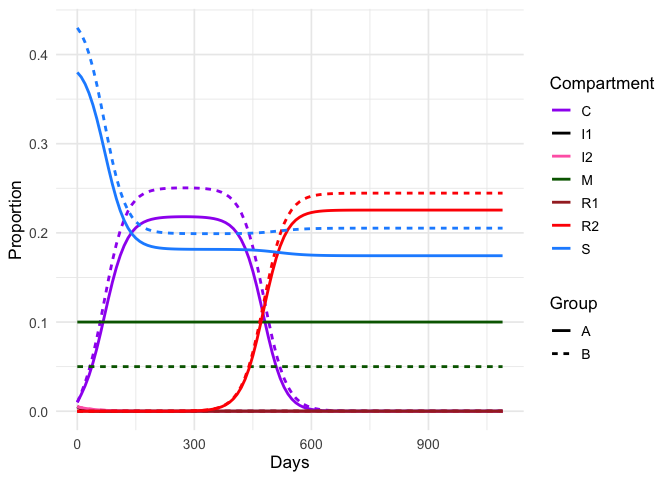
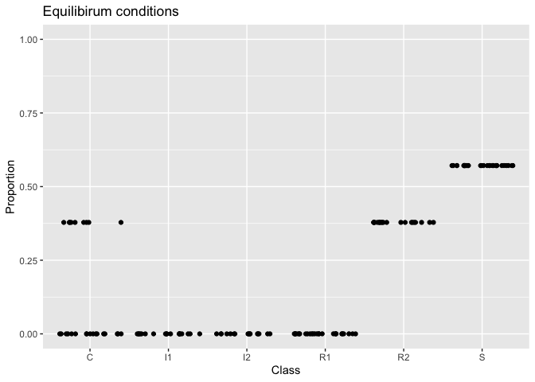

Antibiotic-resistance.Rmd
================
2026-02-19

# Antibiotic-resistance-modeling

Here is the final model with populations A (high antibiotic use, high
“immunity”) and population B (low antibiotic use,low “immunity”) in a
2-group structured model.

\#Load libraries

``` r
library(tidyverse) 
```

    ## Warning: package 'ggplot2' was built under R version 4.5.2

    ## Warning: package 'tibble' was built under R version 4.5.2

    ## Warning: package 'tidyr' was built under R version 4.5.2

    ## Warning: package 'purrr' was built under R version 4.5.2

    ## ── Attaching core tidyverse packages ──────────────────────── tidyverse 2.0.0 ──
    ## ✔ dplyr     1.1.4     ✔ readr     2.1.5
    ## ✔ forcats   1.0.1     ✔ stringr   1.6.0
    ## ✔ ggplot2   4.0.1     ✔ tibble    3.3.1
    ## ✔ lubridate 1.9.4     ✔ tidyr     1.3.2
    ## ✔ purrr     1.2.1     
    ## ── Conflicts ────────────────────────────────────────── tidyverse_conflicts() ──
    ## ✖ dplyr::filter() masks stats::filter()
    ## ✖ dplyr::lag()    masks stats::lag()
    ## ℹ Use the conflicted package (<http://conflicted.r-lib.org/>) to force all conflicts to become errors

``` r
library(odin)
library(pkgbuild)
library(pkgload)
library(numDeriv)
library(rootSolve)
```

    ## 
    ## Attaching package: 'rootSolve'
    ## 
    ## The following object is masked from 'package:numDeriv':
    ## 
    ##     hessian

``` r
library(deSolve)
library(ggplot2)
library(tidyr)
library(dplyr)
```

\##Final model: Modeling the population as a 2 group structured
populations A and B: independent N; slightly different model

``` r
rhs_AB_sepN <- function(t, state, parms) {
  with(as.list(state), {

    # parameters 
    e    <- parms$e
    f    <- parms$f
    r    <- parms$r
    g    <- parms$g
    u    <- parms$u
    Mvec <- parms$M
    beta  <- as.matrix(parms$beta)
    betap <- as.matrix(parms$betap)
    alpha <- as.matrix(parms$alpha)

    # pack state into 2-vectors
    S  <-  c(SA,  SB)
    C  <-  c(CA,  CB)
    I1  <- c(I1A, I1B)
    I2  <- c(I2A, I2B)
    R1 <-  c(R1A, R1B)
    R2 <-  c(R2A, R2B)

    Nvec <- S + C + I1 + I2 + R1 + R2 + Mvec      
    ICN_vec <- (I1 + I2 + C) / Nvec               
    R1_vec  <- R1 / Nvec
    R2_vec  <- R2 / Nvec
    RN_vec  <- R1_vec + R2_vec
    RN_diag <- diag(RN_vec, 2, 2)
 
    inf_I1 <- as.vector(beta  %*% ICN_vec) * S * u
    inf_I2 <- as.vector(beta  %*% ICN_vec) * S * (1-u)
    inf_C <- as.vector(betap %*% ICN_vec) * S
    res_from_C       <- as.vector(alpha %*% (RN_diag %*% C))
    res_to_R1_from_S <- as.vector(beta  %*% (RN_diag %*% S))
    res_to_R2_from_S <- as.vector(betap %*% (RN_diag %*% S))
    res_from_I1       <- as.vector(alpha %*% (RN_diag %*% I1))
    res_from_I2       <- as.vector(alpha %*% (RN_diag %*% I2))

    dI1  <- inf_I1 - e*r*I1 - e*(1-r)*I1 - res_from_I1
    dI2  <- inf_I2 - g*I2 - res_from_I2
    dC   <- inf_C  - f*C - res_from_C
    
    dR1  <- res_to_R1_from_S + res_from_I2+ res_from_I1 + r*e*I1 - g*R1 
    dR2 <-  res_to_R2_from_S + res_from_C - f*R2 
    
    dS <- -inf_I1 - inf_I2 - inf_C - res_to_R1_from_S - res_to_R2_from_S +
           f*C + g*R1 + f*R2 + (1-r)*e*I1 + g*I2

    list(c(
  dSA  = dS[1],  dCA  = dC[1],  dI1A = dI1[1], dI2A = dI2[1], dR1A = dR1[1], dR2A = dR2[1],
  dSB  = dS[2],  dCB  = dC[2],  dI1B = dI1[2], dI2B = dI2[2], dR1B = dR1[2], dR2B = dR2[2]
))
 
  })
}

# Parameters
parms <- list(
  e = 1/14,
  f = 1/35,
  g = 1/45,
  r = 3e-6,
  M = c(0.10, 0.05),
  cW = 10,
  cB = 5,
  aA = 0.0002,
  aB = 0.0004,
  p  = 0.005,
  u  = c(1,0.5)
)

# Define alpha, beta, betap 
parms$beta <- with(parms, matrix(c(
  cW*aA*p, cB*aA*p,
  cB*aB*p, cW*aB*p
), 2, 2, byrow = TRUE))

parms$alpha <- with(parms, matrix(c(
  cW*p, cB*p,
  cB*p, cW*p
), 2, 2, byrow = TRUE))

parms$betap <- with(parms, matrix(c(
  cW*(1-aA)*p, cB*(1-aA)*p,
  cB*(1-aB)*p, cW*(1-aB)*p
), 2, 2, byrow = TRUE))

# Start state
state0 <- c(
  SA=0.38, CA=0.01, I1A=0.005, I2A=0.005, R1A=0.00, R2A=0.00,
  SB=0.43, CB=0.01, I1B=0.005, I2B=0.005, R1B=0.00, R2B=0.00
)

# run with the SAME parms/state0 as you already have:
times <- seq(0, 1095, by = 10)
out_sepN <- ode(y = state0, times = times, func = rhs_AB_sepN, parms = parms)

df <- as.data.frame(out_sepN)
df$MA <- parms$M[1]
df$MB <- parms$M[2]

df_long <- df %>%
  pivot_longer(-time, names_to="var", values_to="value") %>%
  mutate(group = ifelse(grepl("A$", var), "A", "B"),
         compartment = gsub("A$|B$", "", var))

ggplot(df_long, aes(x=time, y=value, color=compartment, linetype=group)) +
  geom_line(linewidth=1) +
  scale_color_manual(values=c("purple","black","hotpink","darkgreen","brown","red","dodgerblue")) +
  theme_minimal(base_size=13) +
  labs(x="Days", y="Proportion", color="Compartment", linetype="Group")
```

<!-- -->

\##Final model: Equilibirium and stability analysis for the 2 group
structured model

``` r
## Equilibrium solver for two-group resistance model
parms <- list(
  e = 1/14,
  f = 1/35,
  g = 1/45,
  r = 3e-6,
  MA = 0.10,
  MB = 0.05,
  cW = 10,
  cB = 5,
  aA = 0.0002,
  aB = 0.0004,
  p = 0.005,
  uA = 1.0,
  uB = 0.5
)

# Pre-compute matrices
parms$beta <- with(parms, matrix(c(
  cW*aA*p, cB*aA*p,
  cB*aB*p, cW*aB*p
), 2, 2, byrow = TRUE))

parms$alpha <- with(parms, matrix(c(
  cW*p, cB*p,
  cB*p, cW*p
), 2, 2, byrow = TRUE))

parms$betap <- with(parms, matrix(c(
  cW*(1-aA)*p, cB*(1-aA)*p,
  cB*(1-aB)*p, cW*(1-aB)*p
), 2, 2, byrow = TRUE))

eq_fn <- function(x, parms) {
  SA <- x[1]; CA <- x[2]; I1A <- x[3]; I2A <- x[4]; R1A <- x[5] ; R2A <- x[6]
  SB <- x[7]; CB <- x[8]; I1B <- x[9]; I2B <- x[10]; R1B <- x[11]; R2B <- x[12]
  
  # Extract parameters
  e <- parms$e
  f <- parms$f
  g <- parms$g
  r <- parms$r
  MA <- parms$MA
  MB <- parms$MB
  uA <- parms$uA
  uB <- parms$uB
  beta <- parms$beta
  betap <- parms$betap
  alpha <- parms$alpha
  
  # Pack into vectors
  S <- c(SA, SB)
  C <- c(CA, CB)
  I1 <- c(I1A, I1B)
  I2 <- c(I2A, I2B)
  R1 <- c(R1A, R1B)
  R2 <- c(R2A, R2B)
  Mvec <- c(MA, MB)
  u <- c(uA, uB)
  
  # Calculate derived quantities
  Nvec <- S + C + I1 + I2 + R1 + R2 + Mvec
  ICN_vec <- (I1 + I2 + C) / Nvec
  R1_vec <- R1 / Nvec
  R2_vec <- R2 / Nvec
  RN_vec <- R1_vec + R2_vec
  RN_diag <- diag(RN_vec, 2, 2)
  
  # Infection rates
  inf_I1 <- as.vector(beta %*% ICN_vec) * S * u
  inf_I2 <- as.vector(beta %*% ICN_vec) * S * (1 - u)
  inf_C <- as.vector(betap %*% ICN_vec) * S
  
  # Resistance acquisition rates
  res_from_C <- as.vector(alpha %*% (RN_diag %*% C))
  res_to_R1_from_S <- as.vector(beta %*% (RN_diag %*% S))
  res_to_R2_from_S <- as.vector(betap %*% (RN_diag %*% S))
  res_from_I1 <- as.vector(alpha %*% (RN_diag %*% I1))
  res_from_I2 <- as.vector(alpha %*% (RN_diag %*% I2))
  
  # Differential equations
  dI1 <- inf_I1 - e*r*I1 - e*(1-r)*I1 - res_from_I1
  dI2 <- inf_I2 - g*I2 - res_from_I2
  dC <- inf_C - f*C - res_from_C
  dR1 <- res_to_R1_from_S + res_from_I2 + res_from_I1 + r*e*I1 - g*R1
  dR2 <- res_to_R2_from_S + res_from_C - f*R2
  dS <- -inf_I1 - inf_I2 - inf_C - res_to_R1_from_S - res_to_R2_from_S +
        f*C + g*R1 + f*R2 + (1-r)*e*I1 + g*I2
  
  # Mass balance constraint (should equal zero at equilibrium)
  mass_balance <- SA + MA + CA + I1A + I2A + R1A + R2A + 
                  SB + CB + I1B + I2B + R1B + R2B + MB - 1
  
  # Return 12 equations (11 differential equations + 1 constraint)
   c(mass_balance, dC[1], dI1[1], dI2[1], dR1[1], dR2[1],
    dS[2], dC[2], dI1[2], dI2[2], dR1[2], dR2[2])
}

## Find equilibrium from a single starting point
x_start <- c(SA=0.10, CA=0.00, I1A=0.000, I2A=0.000, R1A=0.000, R2A=0.30,
             SB=0.10, CB=0.00, I1B=0.000, I2B=0.000, R1B=0.000, R2B=0.35) #starting close to endemic equilibirium

eq <- multiroot(f = eq_fn, start = x_start, parms = parms)
print(eq$root)
```

    ##           SA           CA          I1A          I2A          R1A          R2A 
    ## 1.288658e-01 0.000000e+00 0.000000e+00 0.000000e+00 5.393284e-05 2.096969e-01 
    ##           SB           CB          I1B          I2B          R1B          R2B 
    ## 2.536417e-01 0.000000e+00 0.000000e+00 0.000000e+00 1.325377e-04 2.576092e-01

``` r
#Population B has a higher proportion of people who are resistant carriers in the steady state! 

##Stability
eq_point <- as.numeric(eq$root)
jac <- jacobian(func = eq_fn, x = eq_point, parms = parms)
eigen(jac)$values
```

    ##  [1]  1.016279e+00 -1.065823e-01 -8.313644e-02 -5.738028e-02 -3.727856e-02
    ##  [6] -3.565717e-02 -3.393409e-02 -3.107270e-02 -2.884228e-02 -2.222297e-02
    ## [11] -2.222232e-02 -1.008083e-13

``` r
#The steady states are not stable.

## Check with multiple random starting conditions
set.seed(42)
n_starts <- 50
starts <- replicate(n_starts, {
  # Split between groups A and B
  groupA_total <- 0.40
  groupB_total <- 0.45
  
  # Distribute within group A (INCLUDING SA)
  xA <- runif(6)  
  xA <- xA / sum(xA) * groupA_total
  
  # Distribute within group B
  xB <- runif(6)
  xB <- xB / sum(xB) * groupB_total
  
  x <- c(xA, xB)
  names(x) <- c("SA", "CA", "I1A", "I2A", "R1A", "R2A",  
                "SB", "CB", "I1B", "I2B", "R1B", "R2B")
  x
}, simplify = FALSE)

# Solve from each starting point AND keep the starting point
results <- lapply(1:length(starts), function(i) {
  st <- starts[[i]]
  out <- try(multiroot(eq_fn, start = st, parms = parms, maxiter = 1000), silent = TRUE)
  
  # Return both starting point and equilibrium
  list(
    start_id = i,
    start = st,
    equilibrium = out$root,
    converged = !inherits(out, "try-error")
  )
})

# Convert to dataframe
roots_df <- do.call(rbind, lapply(results, function(r) r$equilibrium))
roots_df <- as.data.frame(roots_df)
colnames(roots_df) <- c("SA","CA", "I1A", "I2A", "R1A", "R2A", 
                        "SB", "CB", "I1B", "I2B", "R1B", "R2B")

# Reshape for plotting
roots_long <- roots_df %>%
  pivot_longer(cols = everything(), names_to = "Compartment", values_to = "Proportion") %>%
  mutate(Group = ifelse(grepl("A$", Compartment), "Group A", "Group B"),
         Class = gsub("A$|B$", "", Compartment))

# Plot
ggplot(roots_long, aes(x = Class, y = Proportion, color = Group)) +
  geom_jitter(width = 0.2, alpha = 0.6, size = 2) +
  facet_wrap(~Group) +
  ylim(0, 1.0) +
  theme_minimal(base_size = 13) +
  labs(title = "Equilibrium conditions from multiple starting points",
       subtitle = paste(nrow(roots_df), "successful convergences out of", n_starts, "attempts")) +
  theme(axis.text.x = element_text(angle = 45, hjust = 1))
```

    ## Warning: Removed 345 rows containing missing values or values outside the scale range
    ## (`geom_point()`).

<!-- -->

\##Final model: As separate populations

``` r
#Population A
sir_model <- odin({
#Define total people
  N <- M + S + C + I1+ I2 + R1 + R2 
  
  # Define intermediate terms for clarity
  ICN <- (I1 + I2 + C) / N
  RN <- (R1 + R2) / N
  
  # Define the ODEs (each deriv must be a single expression)
  deriv(S) <- -c*p*ICN*a*S*u - c*p*ICN*a*S*(1-u) - c*p*ICN*S*(1-a) - c*p*RN*a*S - c*p*RN*(1-a)*S + f*C + g*R1 + f*R2 + (1-r)*I1*e + g*I2 
  
  deriv(C) <- -f*C - c*p*RN*C + c*p*ICN*S*(1-a)
  
  deriv(I1) <- c*p*ICN*a*S*u - r*I1*e - (1-r)*e*I1 - c*p*RN*I1
  
  deriv(I2) <- c*p*ICN*a*S*(1-u) - c*p*RN*I2 - g*I2
  
  deriv(R1) <- r*I1*e - g*R1 + c*p*RN*a*S + c*p*RN*I2 + c*p*RN*I1
  
  deriv(R2) <- -f*R2 + c*p*RN*C + c*p*RN*(1-a)*S
  
  deriv(M)  <- 0
  
  # define initial conditions: 
    initial(M) <- 0.10
    initial(S) <- 0.88
    initial(C) <- 0.01
    initial(I1) <- 0.01 
    initial(I2) <- 0.00
    initial(R1) <- 0.00
    initial(R2) <- 0.00
  
  c <- user(10) 
  a <- user(0.0002) 
  f <- user(1/35) 
  e <- user(1/14) 
  g <- user(1/45)
  u <- user(1)
  r <- user(3e-06) 
  p <- user(0.005)
})
```

    ## Generating model in c

    ## ℹ Re-compiling odin1ed4638d (debug build)

    ## ── R CMD INSTALL ───────────────────────────────────────────────────────────────
    ##   ─  installing *source* package ‘odin1ed4638d’ ...
    ##    ** this is package ‘odin1ed4638d’ version ‘0.0.1’
    ##      ** using staged installation
    ##      ** libs
    ##      using C compiler: ‘Apple clang version 17.0.0 (clang-1700.0.13.5)’
    ##      using SDK: ‘MacOSX15.5.sdk’
    ##      clang -arch arm64 -std=gnu2x -I"/Library/Frameworks/R.framework/Resources/include" -DNDEBUG   -I/opt/R/arm64/include    -fPIC  -falign-functions=64 -Wall -g -O2  -UNDEBUG -Wall -pedantic -g -O0 -c odin.c -o odin.o
    ##      odin.c:152:18: warning: unused variable 'internal' [-Wunused-variable]
    ##      152 |   odin_internal *internal = odin_get_internal(internal_p, 1);
    ##          |                  ^~~~~~~~
    ##      odin.c:259:52: warning: format specifies type 'int' but the argument has type 'const char *' [-Wformat]
    ##      259 |       Rf_error("Expected scalar integer for '%d'", name);
    ##          |                                              ~~    ^~~~
    ##          |                                              %s
    ##      2 warnings generated.
    ##      clang -arch arm64 -std=gnu2x -I"/Library/Frameworks/R.framework/Resources/include" -DNDEBUG   -I/opt/R/arm64/include    -fPIC  -falign-functions=64 -Wall -g -O2  -UNDEBUG -Wall -pedantic -g -O0 -c registration.c -o registration.o
    ##      clang -arch arm64 -std=gnu2x -dynamiclib -Wl,-headerpad_max_install_names -undefined dynamic_lookup -L/Library/Frameworks/R.framework/Resources/lib -L/opt/R/arm64/lib -o odin1ed4638d.so odin.o registration.o -F/Library/Frameworks/R.framework/.. -framework R
    ##      installing to /private/var/folders/z3/b12ywj857y3dgs1x20wklpfm0000gn/T/RtmpNVMzLi/devtools_install_17be62ff36e96/00LOCK-file17be63f431cba/00new/odin1ed4638d/libs
    ##      ** checking absolute paths in shared objects and dynamic libraries
    ##   ─  DONE (odin1ed4638d)
    ## 

    ## ℹ Loading odin1ed4638d

``` r
# Generate the model
model <- sir_model$new()

# Run it
t <- seq(from=0, to=2190, by=10)
sol <- as_tibble(data.frame(model$run(t)))

end_labels <- sol %>% pivot_longer(-t) %>% group_by(name) %>% filter(t == max(t)) %>% ungroup()%>%
  mutate(
    y_jitter = value + seq(-0.02, 0.03, length.out = n())
  )

figure<- sol %>% 
    pivot_longer(-t) %>% 
    ggplot(aes(x=t, y=value, col=factor(name, levels=c("M","S","C","I1","I2","R1","R2")))) + 
    geom_line() + xlab("Days(t)")+ ylab("Proportion")+
  scale_color_manual(values=c("forestgreen","dodgerblue","purple","black","hotpink","brown","red"),
                     label=c("Immune","Susceptible","Carrier","Infected_antibiotics","Infected_no_antibiotics",
                             "Resistant_infeced","Resistant_carrier"))+
    theme_classic() + 
  geom_text(data = end_labels,
            aes(x = t, y = y_jitter, label = sprintf("%.2f", value)),hjust=0.4,size = 3,show.legend = FALSE)+
    theme(legend.title=element_blank())

figure
```

<!-- -->

``` r
#Population B
sir_model <- odin({
#Define total people
  N <- M + S + C + I1+ I2 + R1 + R2 
  
  # Define intermediate terms for clarity
  ICN <- (I1 + I2 + C) / N
  RN <- (R1 + R2) / N
  
  # Define the ODEs (each deriv must be a single expression)
  deriv(S) <- -c*p*ICN*a*S*u - c*p*ICN*a*S*(1-u) - c*p*ICN*S*(1-a) - c*p*RN*a*S - c*p*RN*(1-a)*S + f*C + g*R1 + f*R2 + (1-r)*I1*e + g*I2 
  
  deriv(C) <- -f*C - c*p*RN*C + c*p*ICN*S*(1-a)
  
  deriv(I1) <- c*p*ICN*a*S*u - r*I1*e - (1-r)*e*I1 - c*p*RN*I1
  
  deriv(I2) <- c*p*ICN*a*S*(1-u) - c*p*RN*I2 - g*I2
  
  deriv(R1) <- r*I1*e - g*R1 + c*p*RN*a*S + c*p*RN*I2 + c*p*RN*I1
  
  deriv(R2) <- -f*R2 + c*p*RN*C + c*p*RN*(1-a)*S
  
  deriv(M)  <- 0
  
  # define initial conditions: 
    initial(M) <- 0.05
    initial(S) <- 0.93
    initial(C) <- 0.01
    initial(I1) <- 0.01 
    initial(I2) <- 0.00
    initial(R1) <- 0.00
    initial(R2) <- 0.00
  
  c <- user(10) 
  a <- user(0.0004) 
  f <- user(1/35) 
  e <- user(1/14) 
  g <- user(1/45)
  u <- user(0.5)
  r <- user(3e-06) 
  p <- user(0.005)
})
```

    ## Generating model in c

    ## ℹ Re-compiling odinf74973bb (debug build)

    ## ── R CMD INSTALL ───────────────────────────────────────────────────────────────
    ##   ─  installing *source* package ‘odinf74973bb’ ...
    ##    ** this is package ‘odinf74973bb’ version ‘0.0.1’
    ##      ** using staged installation
    ##      ** libs
    ##      using C compiler: ‘Apple clang version 17.0.0 (clang-1700.0.13.5)’
    ##      using SDK: ‘MacOSX15.5.sdk’
    ##      clang -arch arm64 -std=gnu2x -I"/Library/Frameworks/R.framework/Resources/include" -DNDEBUG   -I/opt/R/arm64/include    -fPIC  -falign-functions=64 -Wall -g -O2  -UNDEBUG -Wall -pedantic -g -O0 -c odin.c -o odin.o
    ##      odin.c:152:18: warning: unused variable 'internal' [-Wunused-variable]
    ##      152 |   odin_internal *internal = odin_get_internal(internal_p, 1);
    ##          |                  ^~~~~~~~
    ##      odin.c:259:52: warning: format specifies type 'int' but the argument has type 'const char *' [-Wformat]
    ##      259 |       Rf_error("Expected scalar integer for '%d'", name);
    ##          |                                              ~~    ^~~~
    ##          |                                              %s
    ##      2 warnings generated.
    ##      clang -arch arm64 -std=gnu2x -I"/Library/Frameworks/R.framework/Resources/include" -DNDEBUG   -I/opt/R/arm64/include    -fPIC  -falign-functions=64 -Wall -g -O2  -UNDEBUG -Wall -pedantic -g -O0 -c registration.c -o registration.o
    ##      clang -arch arm64 -std=gnu2x -dynamiclib -Wl,-headerpad_max_install_names -undefined dynamic_lookup -L/Library/Frameworks/R.framework/Resources/lib -L/opt/R/arm64/lib -o odinf74973bb.so odin.o registration.o -F/Library/Frameworks/R.framework/.. -framework R
    ##      installing to /private/var/folders/z3/b12ywj857y3dgs1x20wklpfm0000gn/T/RtmpNVMzLi/devtools_install_17be64f4eef40/00LOCK-file17be63af82367/00new/odinf74973bb/libs
    ##      ** checking absolute paths in shared objects and dynamic libraries
    ##   ─  DONE (odinf74973bb)
    ## 

    ## ℹ Loading odinf74973bb

``` r
# Generate a specific odin instance: 
model <- sir_model$new() 

# Solve/simulate from this model: 
# First define some time points: 
t <- seq(from=0, to=2190, by=10)
sol <- as_tibble(data.frame(model$run(t)))

end_labels <- sol %>% pivot_longer(-t) %>% group_by(name) %>% filter(t == max(t)) %>% ungroup()%>%
  mutate(
    y_jitter = value + seq(-0.02, 0.03, length.out = n())
  )

figure<- sol %>% 
    pivot_longer(-t) %>% 
    ggplot(aes(x=t, y=value, col=factor(name, levels=c("M","S","C","I1","I2","R1","R2")))) + 
    geom_line() + xlab("Days(t)")+ ylab("Proportion")+
  scale_color_manual(values=c("forestgreen","dodgerblue","purple","black","hotpink","brown","red"),
                     label=c("Immune","Susceptible","Carrier","Infected_antibiotics","Infected_no_antibiotics",
                             "Resistant_infeced","Resistant_carrier"))+
    theme_classic() + 
  geom_text(data = end_labels,
            aes(x = t, y = y_jitter, label = sprintf("%.2f", value)),hjust=0.4,size = 3,show.legend = FALSE)+
    theme(legend.title=element_blank())

figure
```

<!-- -->

\##Final model: Equilibirium and stability analysis for separate
populations

``` r
#Population A
sir_model <- odin({
#Define total people
  N <- M + S + C + I1+ I2 + R1 + R2 
  
  # Define intermediate terms for clarity
  ICN <- (I1 + I2 + C) / N
  RN <- (R1 + R2) / N
  
  # Define the ODEs (each deriv must be a single expression)
  deriv(S) <- -c*p*ICN*a*S*u - c*p*ICN*a*S*(1-u) - c*p*ICN*S*(1-a) - c*p*RN*a*S - c*p*RN*(1-a)*S + f*C + g*R1 + f*R2 + (1-r)*I1*e + g*I2 
  
  deriv(C) <- -f*C - c*p*RN*C + c*p*ICN*S*(1-a)
  
  deriv(I1) <- c*p*ICN*a*S*u - r*I1*e - (1-r)*e*I1 - c*p*RN*I1
  
  deriv(I2) <- c*p*ICN*a*S*(1-u) - c*p*RN*I2 - g*I2
  
  deriv(R1) <- r*I1*e - g*R1 + c*p*RN*a*S + c*p*RN*I2 + c*p*RN*I1
  
  deriv(R2) <- -f*R2 + c*p*RN*C + c*p*RN*(1-a)*S
  
  deriv(M)  <- 0
  
  # define initial conditions: 
    initial(M) <- 0.10
    initial(S) <- 0.88
    initial(C) <- 0.01
    initial(I1) <- 0.01 
    initial(I2) <- 0.00
    initial(R1) <- 0.00
    initial(R2) <- 0.00
  
  c <- user(10) 
  a <- user(0.0002) 
  f <- user(1/35) 
  e <- user(1/14) 
  g <- user(1/45)
  u <- user(1)
  r <- user(3e-06) 
  p <- user(0.005)
})
```

    ## Generating model in c

    ## Using cached model

``` r
# Generate the model
model <- sir_model$new()

# Solve/simulate from this model: 
t <- seq(from=0, to=2190, by=10) 
sol <- as_tibble(data.frame(model$run(t)))

##Lets solve for equilibrium abundances numerically:
parms <- list(c=10, a=0.0002, f=1/35, e=1/14, g=1/45, r=3e-06, p=0.005, M=0.10, u=1.00)

eq_fn <- function(x, parms){
  S  <- x[1]; C <- x[2]; I1 <- x[3]; I2 <- x[4]; R1 <- x[5]; R2 <- x[6]
  with(parms, {
    N <- S + C + I1 + I2 + R1 + R2 + M
    ICN <- (I1 + I2 + C) / N
    RN <- (R1 + R2) / N
    
    dS  <- -c*p*ICN*a*S*u - c*p*ICN*a*S*(1-u) - c*p*ICN*S*(1-a) - c*p*RN*a*S - c*p*RN*(1-a)*S + f*C + g*R1 + f*R2 + (1-r)*I1*e + g*I2 
    dC  <- -f*C - c*p*RN*C + c*p*ICN*S*(1-a)
    dI1 <- c*p*ICN*a*S*u - r*I1*e - (1-r)*e*I1 - c*p*RN*I1
    dI2 <- c*p*ICN*a*S*(1-u) - c*p*RN*I2 - g*I2
    dR1 <- r*I1*e - g*R1 + c*p*RN*a*S + c*p*RN*I2 + c*p*RN*I1
    dR2 <- -f*R2 + c*p*RN*C + c*p*RN*(1-a)*S
    
    # Mass balance: fix the typo (I -> I1 + I2)
    mass <- S + C + I1 + I2 + R1 + R2 - (1 - M)
    
    # Return 6 equations: 5 ODEs + mass balance (drop dS as redundant)
    c(dC, dI1, dI2, dR1, dR2, mass)
  })
}

# Starting point
x_start <- c(S=0.60, C=0.00, I1=0.000, I2=0.000, R1=0.00, R2=0.30)
eq <- multiroot(f=eq_fn, start=x_start, parms=parms)
eq$root
```

    ##            S            C           I1           I2           R1           R2 
    ## 5.713959e-01 0.000000e+00 0.000000e+00 0.000000e+00 8.449336e-05 3.285196e-01

``` r
eq_fn(eq$root, parms)   # should be ~0 for all 5 equations
```

    ##             C            I1            I1            I1            R2 
    ##  0.000000e+00  0.000000e+00  0.000000e+00 -7.374907e-15 -3.686924e-11 
    ##             S 
    ## -3.014256e-13

``` r
sum(eq$root) + parms$M  # should be ~1
```

    ## [1] 1

``` r
##Check iteratively with many random starting conditions
set.seed(1)
starts <- replicate(30, {
  x <- runif(6)
  x <- x / sum(x) * (1 - parms$M)   # enforce sum=0.9
  names(x) <- c("S","C","I1","I2","R1","R2")
  x
}, simplify=FALSE)

roots <- lapply(starts, function(st){
  out <- try(multiroot(eq_fn, start=st, parms=parms)$root, silent=TRUE)
  if(inherits(out, "try-error")) return(rep(NA,5))
  out
})

do.call(rbind, roots)
```

    ##               S             C            I1            I2            R1
    ##  [1,] 0.5713959  3.386762e-08  3.470158e-12  1.943440e-22  8.449336e-05
    ##  [2,] 0.5714971  3.284770e-01  2.628157e-05 -1.867803e-08  2.477203e-08
    ##  [3,] 0.5713706  2.530497e-05  2.592794e-09  3.091206e-18  8.449154e-05
    ##  [4,] 0.5713959 -2.171612e-09 -4.298425e-13 -6.091024e-12  8.449337e-05
    ##  [5,] 0.5713959  1.189791e-08  1.219090e-12 -2.859493e-19  8.449336e-05
    ##  [6,] 0.5713615  3.436968e-05  3.521567e-09 -2.879930e-16  8.449088e-05
    ##  [7,] 0.5713869  8.980636e-06  9.201728e-10  1.301859e-17  8.449272e-05
    ##  [8,] 0.5714944  3.284798e-01  2.628262e-05 -1.529001e-07  1.563058e-07
    ##  [9,] 0.5714972  3.284766e-01  2.628338e-05 -3.030788e-10  5.564412e-10
    ## [10,] 0.5713959  5.598610e-08  5.736464e-12 -4.804496e-21  8.449336e-05
    ## [11,] 0.5713928  3.078394e-06  3.141984e-10 -1.122916e-11  8.449316e-05
    ## [12,] 0.5713959  6.674713e-09  6.839118e-13 -1.218302e-24  8.449336e-05
    ## [13,] 0.5713959  1.591283e-08  1.630472e-12 -7.294797e-25  8.449336e-05
    ## [14,] 0.5714972  3.284766e-01  2.628338e-05  1.033883e-08 -1.007541e-08
    ## [15,] 0.5714972  3.284766e-01  2.628338e-05  1.143054e-10  1.330847e-10
    ## [16,] 0.5713959  2.529592e-08  2.591883e-12 -4.811048e-24  8.449336e-05
    ## [17,] 0.5713959  1.861764e-08  1.907364e-12 -1.222948e-16  8.449336e-05
    ## [18,] 0.5713959 -2.052664e-11 -1.862887e-15 -2.528445e-14  8.449336e-05
    ## [19,] 0.5714972  3.284766e-01  2.628338e-05 -4.264771e-13  2.537347e-10
    ## [20,] 0.5713959  1.155594e-08  1.184054e-12 -1.267246e-21  8.449336e-05
    ## [21,] 0.5713931  2.825667e-06  2.895232e-10  1.200165e-20  8.449316e-05
    ## [22,] 0.5713801  1.566303e-05  1.500164e-09 -5.664034e-09  8.449826e-05
    ## [23,] 0.5713957  1.765496e-07  1.808964e-11  5.006672e-20  8.449335e-05
    ## [24,] 0.5714967  3.284771e-01  2.628302e-05 -3.560579e-08  3.714151e-08
    ## [25,] 0.5713849  1.100015e-05  1.126183e-09 -1.050940e-11  8.449258e-05
    ## [26,] 0.5713959 -3.174140e-08 -9.389929e-12 -5.108827e-10  8.449391e-05
    ## [27,] 0.5713889  7.024568e-06  7.194808e-10  4.384100e-12  8.449285e-05
    ## [28,] 0.5714814  3.284923e-01  2.628464e-05 -2.708171e-11  2.800302e-10
    ## [29,] 0.5713694  2.652223e-05  2.717095e-09 -8.557433e-13  8.449145e-05
    ## [30,] 0.5713959  2.405420e-08  2.464654e-12 -9.992089e-28  8.449336e-05
    ##                  R2
    ##  [1,]  3.285196e-01
    ##  [2,] -3.509755e-07
    ##  [3,]  3.285196e-01
    ##  [4,]  3.285196e-01
    ##  [5,]  3.285196e-01
    ##  [6,]  3.285196e-01
    ##  [7,]  3.285196e-01
    ##  [8,] -4.405879e-07
    ##  [9,] -1.149155e-09
    ## [10,]  3.285196e-01
    ## [11,]  3.285196e-01
    ## [12,]  3.285196e-01
    ## [13,]  3.285196e-01
    ## [14,]  8.178008e-09
    ## [15,] -1.540135e-09
    ## [16,]  3.285196e-01
    ## [17,]  3.285196e-01
    ## [18,]  3.285196e-01
    ## [19,] -6.952810e-10
    ## [20,]  3.285196e-01
    ## [21,]  3.285196e-01
    ## [22,]  3.285197e-01
    ## [23,]  3.285196e-01
    ## [24,] -1.217545e-07
    ## [25,]  3.285196e-01
    ## [26,]  3.285196e-01
    ## [27,]  3.285196e-01
    ## [28,] -7.763028e-10
    ## [29,]  3.285196e-01
    ## [30,]  3.285196e-01

``` r
roots <- as.data.frame(roots)
roots <- as.data.frame(t(roots))
rownames(roots) <- seq(1:nrow(roots))
roots <- pivot_longer(roots,cols=1:6)
names(roots) <- c("Class","Proportion")
ggplot(roots,aes(x=Class,y=Proportion))+ geom_jitter()+ ylim(0,1.0)+ labs(title="Equilibirum conditions")
```

    ## Warning: Removed 50 rows containing missing values or values outside the scale range
    ## (`geom_point()`).

<!-- -->

``` r
#Stability
x_eq <- eq$root
J <- numDeriv::jacobian(func = eq_fn, x = x_eq, parms = parms)
eig <- eigen(J)$values
eig 
```

    ## [1]  0.99055014+0.00000000i  0.02606307+0.02723216i  0.02606307-0.02723216i
    ## [4] -0.01431001+0.02160876i -0.01431001-0.02160876i  0.02155559+0.00000000i

``` r
#Population B
sir_model <- odin({
#Define total people
  N <- M + S + C + I1+ I2 + R1 + R2 
  
  # Define intermediate terms for clarity
  ICN <- (I1 + I2 + C) / N
  RN <- (R1 + R2) / N
  
  # Define the ODEs (each deriv must be a single expression)
  deriv(S) <- -c*p*ICN*a*S*u - c*p*ICN*a*S*(1-u) - c*p*ICN*S*(1-a) - c*p*RN*a*S - c*p*RN*(1-a)*S + f*C + g*R1 + f*R2 + (1-r)*I1*e + g*I2 
  
  deriv(C) <- -f*C - c*p*RN*C + c*p*ICN*S*(1-a)
  
  deriv(I1) <- c*p*ICN*a*S*u - r*I1*e - (1-r)*e*I1 - c*p*RN*I1
  
  deriv(I2) <- c*p*ICN*a*S*(1-u) - c*p*RN*I2 - g*I2
  
  deriv(R1) <- r*I1*e - g*R1 + c*p*RN*a*S + c*p*RN*I2 + c*p*RN*I1
  
  deriv(R2) <- -f*R2 + c*p*RN*C + c*p*RN*(1-a)*S
  
  deriv(M)  <- 0
  
  # define initial conditions: 
    initial(M) <- 0.05
    initial(S) <- 0.93
    initial(C) <- 0.01
    initial(I1) <- 0.01 
    initial(I2) <- 0.00
    initial(R1) <- 0.00
    initial(R2) <- 0.00
  
  c <- user(10) 
  a <- user(0.0005) 
  f <- user(1/35) 
  e <- user(1/14) 
  g <- user(1/45)
  u <- user(0.5)
  r <- user(3e-06) 
  p <- user(0.005)
})
```

    ## Generating model in c

    ## ℹ Re-compiling odin94596500 (debug build)

    ## ── R CMD INSTALL ───────────────────────────────────────────────────────────────
    ##   ─  installing *source* package ‘odin94596500’ ...
    ##    ** this is package ‘odin94596500’ version ‘0.0.1’
    ##      ** using staged installation
    ##      ** libs
    ##      using C compiler: ‘Apple clang version 17.0.0 (clang-1700.0.13.5)’
    ##      using SDK: ‘MacOSX15.5.sdk’
    ##      clang -arch arm64 -std=gnu2x -I"/Library/Frameworks/R.framework/Resources/include" -DNDEBUG   -I/opt/R/arm64/include    -fPIC  -falign-functions=64 -Wall -g -O2  -UNDEBUG -Wall -pedantic -g -O0 -c odin.c -o odin.o
    ##      odin.c:152:18: warning: unused variable 'internal' [-Wunused-variable]
    ##      152 |   odin_internal *internal = odin_get_internal(internal_p, 1);
    ##          |                  ^~~~~~~~
    ##      odin.c:259:52: warning: format specifies type 'int' but the argument has type 'const char *' [-Wformat]
    ##      259 |       Rf_error("Expected scalar integer for '%d'", name);
    ##          |                                              ~~    ^~~~
    ##          |                                              %s
    ##      2 warnings generated.
    ##      clang -arch arm64 -std=gnu2x -I"/Library/Frameworks/R.framework/Resources/include" -DNDEBUG   -I/opt/R/arm64/include    -fPIC  -falign-functions=64 -Wall -g -O2  -UNDEBUG -Wall -pedantic -g -O0 -c registration.c -o registration.o
    ##      clang -arch arm64 -std=gnu2x -dynamiclib -Wl,-headerpad_max_install_names -undefined dynamic_lookup -L/Library/Frameworks/R.framework/Resources/lib -L/opt/R/arm64/lib -o odin94596500.so odin.o registration.o -F/Library/Frameworks/R.framework/.. -framework R
    ##      installing to /private/var/folders/z3/b12ywj857y3dgs1x20wklpfm0000gn/T/RtmpNVMzLi/devtools_install_17be6748d92a6/00LOCK-file17be618245ff9/00new/odin94596500/libs
    ##      ** checking absolute paths in shared objects and dynamic libraries
    ##   ─  DONE (odin94596500)
    ## 

    ## ℹ Loading odin94596500

``` r
# Generate the model
model <- sir_model$new()

# Solve/simulate from this model: 
t <- seq(from=0, to=2190, by=10) 
sol <- as_tibble(data.frame(model$run(t)))

##Lets solve for equilibrium abundances numerically:
parms <- list(c=10, a=0.0004, f=1/35, e=1/14, g=1/45, r=3e-06, p=0.005, M=0.05, u=0.50)

eq_fn <- function(x, parms){
  S  <- x[1]; C <- x[2]; I1 <- x[3]; I2 <- x[4]; R1 <- x[5]; R2 <- x[6]
  with(parms, {
    N <- S + C + I1 + I2 + R1 + R2 + M
    ICN <- (I1 + I2 + C) / N
    RN <- (R1 + R2) / N
    
    dS  <- -c*p*ICN*a*S*u - c*p*ICN*a*S*(1-u) - c*p*ICN*S*(1-a) - c*p*RN*a*S - c*p*RN*(1-a)*S + f*C + g*R1 + f*R2 + (1-r)*I1*e + g*I2 
    dC  <- -f*C - c*p*RN*C + c*p*ICN*S*(1-a)
    dI1 <- c*p*ICN*a*S*u - r*I1*e - (1-r)*e*I1 - c*p*RN*I1
    dI2 <- c*p*ICN*a*S*(1-u) - c*p*RN*I2 - g*I2
    dR1 <- r*I1*e - g*R1 + c*p*RN*a*S + c*p*RN*I2 + c*p*RN*I1
    dR2 <- -f*R2 + c*p*RN*C + c*p*RN*(1-a)*S
    
    # Mass balance: fix the typo (I -> I1 + I2)
    mass <- S + C + I1 + I2 + R1 + R2 - (1 - M)
    
    # Return 6 equations: 5 ODEs + mass balance (drop dS as redundant)
    c(dC, dI1, dI2, dR1, dR2, mass)
  })
}

# Starting point
x_start <- c(S=0.60, C=0.00, I1=0.000, I2=0.000, R1=0.00, R2=0.30)
eq <- multiroot(f=eq_fn, start=x_start, parms=parms)
eq$root
```

    ##            S            C           I1           I2           R1           R2 
    ## 0.5713632728 0.0000000000 0.0000000000 0.0000000000 0.0001947052 0.3784420220

``` r
eq_fn(eq$root, parms)   # should be ~0 for all 5 equations
```

    ##             C            I1            I1            I1            R2 
    ##  0.000000e+00  0.000000e+00  0.000000e+00 -1.161960e-17 -2.911386e-14 
    ##             S 
    ##  0.000000e+00

``` r
sum(eq$root) + parms$M  # should be ~1
```

    ## [1] 1

``` r
##Check iteratively with many random starting conditions
set.seed(1)
starts <- replicate(30, {
  x <- runif(6)
  x <- x / sum(x) * (1 - parms$M)   # enforce sum=0.95
  names(x) <- c("S","C","I1","I2","R1","R2")
  x
}, simplify=FALSE)

roots <- lapply(starts, function(st){
  out <- try(multiroot(eq_fn, start=st, parms=parms)$root, silent=TRUE)
  if(inherits(out, "try-error")) return(rep(NA,5))
  out
})

do.call(rbind, roots)
```

    ##               S             C            I1            I2            R1
    ##  [1,] 0.5713633  7.796702e-09  8.200864e-13  1.800635e-12  1.947052e-04
    ##  [2,] 0.5714645  3.784079e-01  3.028419e-05  9.733839e-05  7.502939e-09
    ##  [3,] 0.5713536  9.681666e-06  1.018359e-09  2.235960e-09  1.947047e-04
    ##  [4,] 0.5713633 -6.231798e-12 -7.265625e-16 -1.281310e-14  1.947052e-04
    ##  [5,] 0.5713386  2.468785e-05  2.596318e-09  5.703970e-09  1.947039e-04
    ##  [6,] 0.5713501  1.318009e-05  1.386337e-09  3.043913e-09  1.947045e-04
    ##  [7,] 0.5713602  3.037285e-06  3.194746e-10  7.014546e-10  1.947050e-04
    ##  [8,] 0.5714639  3.784086e-01  3.028446e-05  9.729365e-05  5.170179e-08
    ##  [9,] 0.5714645  3.784079e-01  3.028474e-05  9.734382e-05  2.917668e-10
    ## [10,] 0.5713633  1.053007e-08  1.107610e-12  2.431890e-12  1.947052e-04
    ## [11,] 0.5713617  1.386037e-06 -1.575768e-10 -4.692263e-09  1.947112e-04
    ## [12,] 0.5713452  1.803259e-05  1.896358e-09  4.163123e-09  1.947042e-04
    ## [13,] 0.5713633  2.731099e-09  2.872748e-13  6.307371e-13  1.947052e-04
    ## [14,] 0.5714645  3.784079e-01  3.028474e-05  9.734372e-05  3.925713e-10
    ## [15,] 0.5714645  3.784079e-01  3.028474e-05  9.734382e-05  2.876036e-10
    ## [16,] 0.5713633  4.423735e-09  4.653151e-13  1.021647e-12  1.947052e-04
    ## [17,] 0.5713633  9.502257e-09  8.552224e-13 -2.092727e-12  1.947052e-04
    ## [18,] 0.5714636  3.784088e-01  3.028482e-05  9.734406e-05  2.916790e-10
    ## [19,] 0.5714645  3.784079e-01  3.028477e-05  9.735104e-05 -6.996958e-09
    ## [20,] 0.5713360  2.724269e-05  2.865497e-09  6.291645e-09  1.947037e-04
    ## [21,] 0.5713624  8.526217e-07  8.967483e-11  1.969128e-10  1.947052e-04
    ## [22,] 0.5713633 -2.684923e-10 -1.279895e-13 -1.326216e-11  1.947052e-04
    ## [23,] 0.5713632  6.231498e-08  6.553485e-12  1.439144e-11  1.947052e-04
    ## [24,] 0.5714644  3.784080e-01  3.028461e-05  9.733162e-05  1.296284e-08
    ## [25,] 0.5713595  3.725452e-06  3.252336e-10 -4.736935e-09  1.947109e-04
    ## [26,] 0.5713633 -4.708008e-09 -7.919150e-13 -5.034188e-11  1.947053e-04
    ## [27,] 0.5713613  2.017490e-06  2.121860e-10  4.660194e-10  1.947051e-04
    ## [28,] 0.5714598  3.784126e-01  3.028512e-05  9.734501e-05  3.052269e-10
    ## [29,] 0.5713507  1.254982e-05  1.263363e-09  1.486616e-09  1.947061e-04
    ## [30,] 0.5713633  4.553118e-09  4.789243e-13  1.051527e-12  1.947052e-04
    ##                  R2
    ##  [1,]  3.784420e-01
    ##  [2,] -6.621974e-08
    ##  [3,]  3.784420e-01
    ##  [4,]  3.784420e-01
    ##  [5,]  3.784420e-01
    ##  [6,]  3.784420e-01
    ##  [7,]  3.784420e-01
    ##  [8,] -1.118499e-07
    ##  [9,] -7.325189e-10
    ## [10,]  3.784420e-01
    ## [11,]  3.784422e-01
    ## [12,]  3.784420e-01
    ## [13,]  3.784420e-01
    ## [14,] -8.676958e-10
    ## [15,] -7.475935e-10
    ## [16,]  3.784420e-01
    ## [17,]  3.784420e-01
    ## [18,] -7.323638e-10
    ## [19,] -1.091978e-09
    ## [20,]  3.784420e-01
    ## [21,]  3.784420e-01
    ## [22,]  3.784420e-01
    ## [23,]  3.784420e-01
    ## [24,] -3.145130e-08
    ## [25,]  3.784421e-01
    ## [26,]  3.784420e-01
    ## [27,]  3.784420e-01
    ## [28,] -7.626970e-10
    ## [29,]  3.784420e-01
    ## [30,]  3.784420e-01

``` r
roots <- as.data.frame(roots)
roots <- as.data.frame(t(roots))
rownames(roots) <- seq(1:nrow(roots))
roots <- pivot_longer(roots,cols=1:6)
names(roots) <- c("Class","Proportion")
ggplot(roots,aes(x=Class,y=Proportion))+ geom_jitter()+ ylim(0,1.0)+ labs(title="Equilibirum conditions")
```

    ## Warning: Removed 41 rows containing missing values or values outside the scale range
    ## (`geom_point()`).

<!-- -->

``` r
#Stability
x_eq <- eq$root
J <- numDeriv::jacobian(func = eq_fn, x = x_eq, parms = parms)
eig <- eigen(J)$values
eig 
```

    ## [1]  0.98911051+0.00000000i  0.02712410+0.03009177i  0.02712410-0.03009177i
    ## [4] -0.01521797+0.02316452i -0.01521797-0.02316452i  0.02376028+0.00000000i
