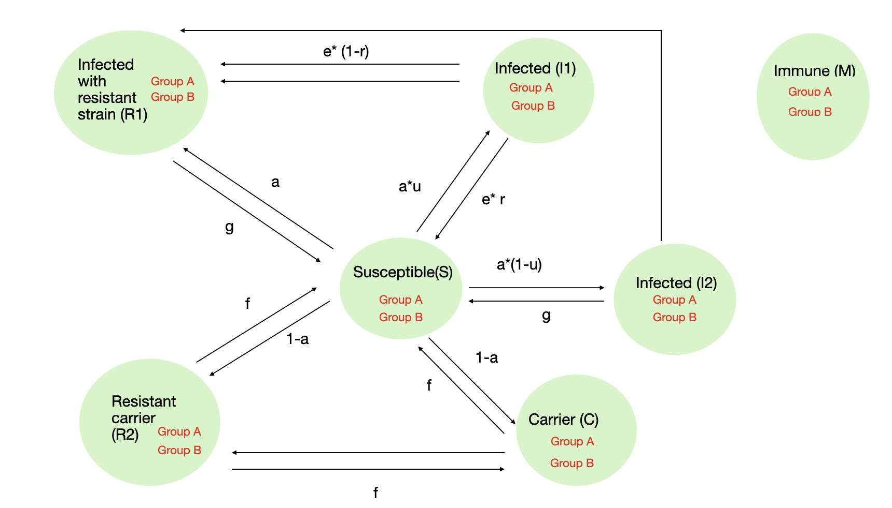
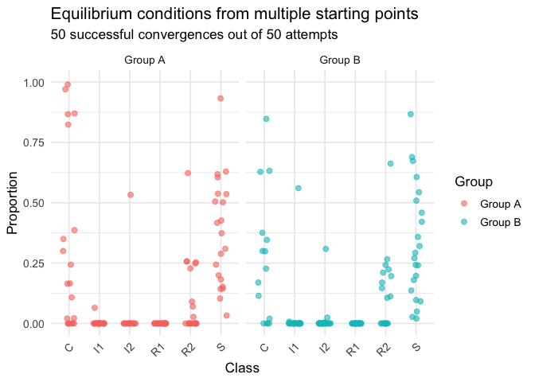

Modeling antibiotic resistance in populations using a compartmental
model
================

Here is the final model with populations A (high antibiotic use, high
“immunity”) and population B (low antibiotic use,low “immunity”) in a
2-group structured model.

In this compartmental model, the compartments are:

S = susceptible

I1 = infected with antibiotic use

I2 = infected with no antibiotic use

R1 = infected with resistant strain

C = asymptomatic carrier

R2 = asymptomatic carrier with resistant strain

M = immune

The parameters are defined as follows:

c = contact rate (10 for within population and 5 for between
populations)

p = probability of transmission (0.005)

a = probability of virulent infection (0.0002 for population A and
0.0004 for population B)

u = probability of antibiotic use (1 for population A and 0.5 for
population B)

f = clearance rate in the absence of virulent infection (1/35)

e = recovery rate in case of virulent infection under antibiotic use
(1/14)

g = recovery rate in case of virulent infection under no antibiotic use
or antibiotic resistance (1/45)

r = probability of resistance emergence (3e-06)

<!-- -->

Equilibrium and stability analysis for the 2 group structured model

    ## The steady state for an endemic equilibrium is: 0.1288658 0 0 0 5.393284e-05 0.2096969 0.2536417 0 0 0 0.0001325377 0.2576092

    ## The eigenvalue of the jacobian calculated at the steady state calculated above is: 1.016279 -0.1065823 -0.08313644 -0.05738028 -0.03727856 -0.03565717 -0.03393409 -0.0310727 -0.02884228 -0.02222297 -0.02222232 -1.008083e-13

We can see that population B has a higher proportion of its population
who carry resistant strains of Streptococcus Pneumonia in equilibrium
conditions. However, we find that this is not a stable equilibrium.

We can also start at multiple randomly generated conditions and follow
the trajectory numerically to assess steady states. Here’s what we get
when we do that.
<!-- -->

Oof! That’s messy!

We can also model them as separate populations.

First, let’s look at population A

    ## Generating model in c

    ## ℹ Re-compiling odin1ed4638d (debug build)

    ## ── R CMD INSTALL ───────────────────────────────────────────────────────────────
    ##   ─  installing *source* package ‘odin1ed4638d’ ...
    ##    ** this is package ‘odin1ed4638d’ version ‘0.0.1’
    ##      ** using staged installation
    ##      ** libs
    ##      using C compiler: ‘Apple clang version 17.0.0 (clang-1700.0.13.5)’
    ##      using SDK: ‘MacOSX15.5.sdk’
    ##      clang -arch arm64 -std=gnu2x -I"/Library/Frameworks/R.framework/Resources/include" -DNDEBUG   -I/opt/R/arm64/include    -fPIC  -falign-functions=64 -Wall -g -O2  -UNDEBUG -Wall -pedantic -g -O0 -c odin.c -o odin.o
    ##      odin.c:152:18: warning: unused variable 'internal' [-Wunused-variable]
    ##      152 |   odin_internal *internal = odin_get_internal(internal_p, 1);
    ##          |                  ^~~~~~~~
    ##      odin.c:259:52: warning: format specifies type 'int' but the argument has type 'const char *' [-Wformat]
    ##      259 |       Rf_error("Expected scalar integer for '%d'", name);
    ##          |                                              ~~    ^~~~
    ##          |                                              %s
    ##      2 warnings generated.
    ##      clang -arch arm64 -std=gnu2x -I"/Library/Frameworks/R.framework/Resources/include" -DNDEBUG   -I/opt/R/arm64/include    -fPIC  -falign-functions=64 -Wall -g -O2  -UNDEBUG -Wall -pedantic -g -O0 -c registration.c -o registration.o
    ##      clang -arch arm64 -std=gnu2x -dynamiclib -Wl,-headerpad_max_install_names -undefined dynamic_lookup -L/Library/Frameworks/R.framework/Resources/lib -L/opt/R/arm64/lib -o odin1ed4638d.so odin.o registration.o -F/Library/Frameworks/R.framework/.. -framework R
    ##      installing to /private/var/folders/z3/b12ywj857y3dgs1x20wklpfm0000gn/T/RtmpB9u2uy/devtools_install_34b606fb863/00LOCK-file34b2fef58c/00new/odin1ed4638d/libs
    ##      ** checking absolute paths in shared objects and dynamic libraries
    ##   ─  DONE (odin1ed4638d)
    ## 

    ## ℹ Loading odin1ed4638d

<!-- -->

    ## The steady state for an endemic equilibrium is: 0.5713959 0 0 0 8.449336e-05 0.3285196

    ## The eigenvalue of the jacobian calculated at the steady state calculated above is: 0.9905501+0i 0.02606307+0.02723216i 0.02606307-0.02723216i -0.01431001+0.02160876i -0.01431001-0.02160876i 0.02155559+0i

33% of the population end up as carriers of resistant strains of
Streptococcus Pneumonia in population A. This steady state, however,
isn’t stable.

Similarly, starting at multiple random conditions give us these steady
states <!-- -->

Now, for population B

    ## Generating model in c

    ## ℹ Re-compiling odinf74973bb (debug build)

    ## ── R CMD INSTALL ───────────────────────────────────────────────────────────────
    ##   ─  installing *source* package ‘odinf74973bb’ ...
    ##    ** this is package ‘odinf74973bb’ version ‘0.0.1’
    ##      ** using staged installation
    ##      ** libs
    ##      using C compiler: ‘Apple clang version 17.0.0 (clang-1700.0.13.5)’
    ##      using SDK: ‘MacOSX15.5.sdk’
    ##      clang -arch arm64 -std=gnu2x -I"/Library/Frameworks/R.framework/Resources/include" -DNDEBUG   -I/opt/R/arm64/include    -fPIC  -falign-functions=64 -Wall -g -O2  -UNDEBUG -Wall -pedantic -g -O0 -c odin.c -o odin.o
    ##      odin.c:152:18: warning: unused variable 'internal' [-Wunused-variable]
    ##      152 |   odin_internal *internal = odin_get_internal(internal_p, 1);
    ##          |                  ^~~~~~~~
    ##      odin.c:259:52: warning: format specifies type 'int' but the argument has type 'const char *' [-Wformat]
    ##      259 |       Rf_error("Expected scalar integer for '%d'", name);
    ##          |                                              ~~    ^~~~
    ##          |                                              %s
    ##      2 warnings generated.
    ##      clang -arch arm64 -std=gnu2x -I"/Library/Frameworks/R.framework/Resources/include" -DNDEBUG   -I/opt/R/arm64/include    -fPIC  -falign-functions=64 -Wall -g -O2  -UNDEBUG -Wall -pedantic -g -O0 -c registration.c -o registration.o
    ##      clang -arch arm64 -std=gnu2x -dynamiclib -Wl,-headerpad_max_install_names -undefined dynamic_lookup -L/Library/Frameworks/R.framework/Resources/lib -L/opt/R/arm64/lib -o odinf74973bb.so odin.o registration.o -F/Library/Frameworks/R.framework/.. -framework R
    ##      installing to /private/var/folders/z3/b12ywj857y3dgs1x20wklpfm0000gn/T/RtmpB9u2uy/devtools_install_34b2f57f8c/00LOCK-file34b62296ffb/00new/odinf74973bb/libs
    ##      ** checking absolute paths in shared objects and dynamic libraries
    ##   ─  DONE (odinf74973bb)
    ## 

    ## ℹ Loading odinf74973bb

<!-- -->

    ## The steady state for an endemic equilibrium is: 0.5713633 0 0 0 0.0001947052 0.378442

    ## The eigenvalue of the jacobian calculated at the steady state calculated above is: 0.9891105+0i 0.0271241+0.03009177i 0.0271241-0.03009177i -0.01521797+0.02316452i -0.01521797-0.02316452i 0.02376028+0i

38% of the population end up as carriers of resistant strains of
Streptococcus Pneumonia in population A. This steady state is also not
stable.

Starting at multiple random conditions give us these steady states
<!-- -->

In conclusion, can see that population B, despite using antibiotics only
50% of the time that they get an infection with Streptococcus Pneumonia,
end up with a higher proportion of its population who become carriers of
resistant strains no matter how me model the system.
